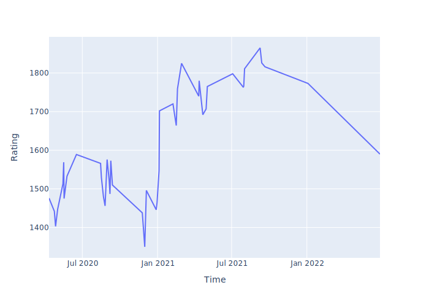

# 대충 레포 제목

BOJ Problem Count = 142

---

## 코드포스 레이팅
---

## 최근 푼 문제 (BaekJoon)
| 문제 번호 | 문제 이름 | 난이도 | 풀이 코드 |
| --- | --- | --- | --- |
| 23795 | [사장님 도박은 재미로 하셔야 합니다](https://www.acmicpc.net/problem/23795) |  |  |
| 25639 | [수열과 최대 상승 쿼리](https://www.acmicpc.net/problem/25639) |  |  |
| 25191 | [치킨댄스를 추는 곰곰이를 본 임스](https://www.acmicpc.net/problem/25191) |  |  |
| 18496 | [Euclid’s Algorithm](https://www.acmicpc.net/problem/18496) |  |  |
| 15504 | [프로그래밍 대결](https://www.acmicpc.net/problem/15504) |  |  |
| 11410 | [칙칙폭폭](https://www.acmicpc.net/problem/11410) |  |  |
| 11408 | [열혈강호 5](https://www.acmicpc.net/problem/11408) |  |  |
| 11405 | [책 구매하기](https://www.acmicpc.net/problem/11405) |  |  |
| 11111 | [두부장수 장홍준 2](https://www.acmicpc.net/problem/11111) |  |  |
| 9987 | [포켓몬 마스터](https://www.acmicpc.net/problem/9987) |  |  |

---

last updated : Tue Sep 27 21:44:55 2022

