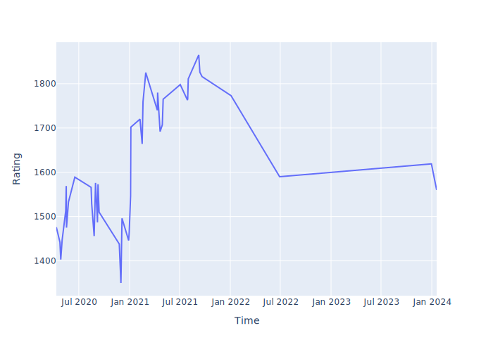

# 대충 레포 제목

BOJ Problem Count = 142

---

## 코드포스 레이팅
---

## 최근 푼 문제 (BaekJoon)
| 문제 번호 | 문제 이름 | 난이도 | 풀이 코드 |
| --- | --- | --- | --- |
| 1057 | [토너먼트](https://www.acmicpc.net/problem/1057) |  |  |
| 10974 | [모든 순열](https://www.acmicpc.net/problem/10974) |  |  |
| 3036 | [링](https://www.acmicpc.net/problem/3036) |  |  |
| 1748 | [수 이어 쓰기 1](https://www.acmicpc.net/problem/1748) |  |  |
| 3049 | [다각형의 대각선](https://www.acmicpc.net/problem/3049) |  |  |
| 2960 | [에라토스테네스의 체](https://www.acmicpc.net/problem/2960) |  |  |
| 10825 | [국영수](https://www.acmicpc.net/problem/10825) |  |  |
| 10709 | [기상캐스터](https://www.acmicpc.net/problem/10709) |  |  |
| 5555 | [반지](https://www.acmicpc.net/problem/5555) |  |  |
| 2018 | [수들의 합 5](https://www.acmicpc.net/problem/2018) |  |  |

---

last updated : Sat Aug 20 21:44:09 2022

